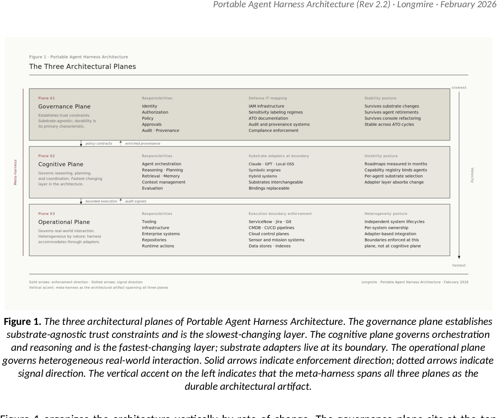
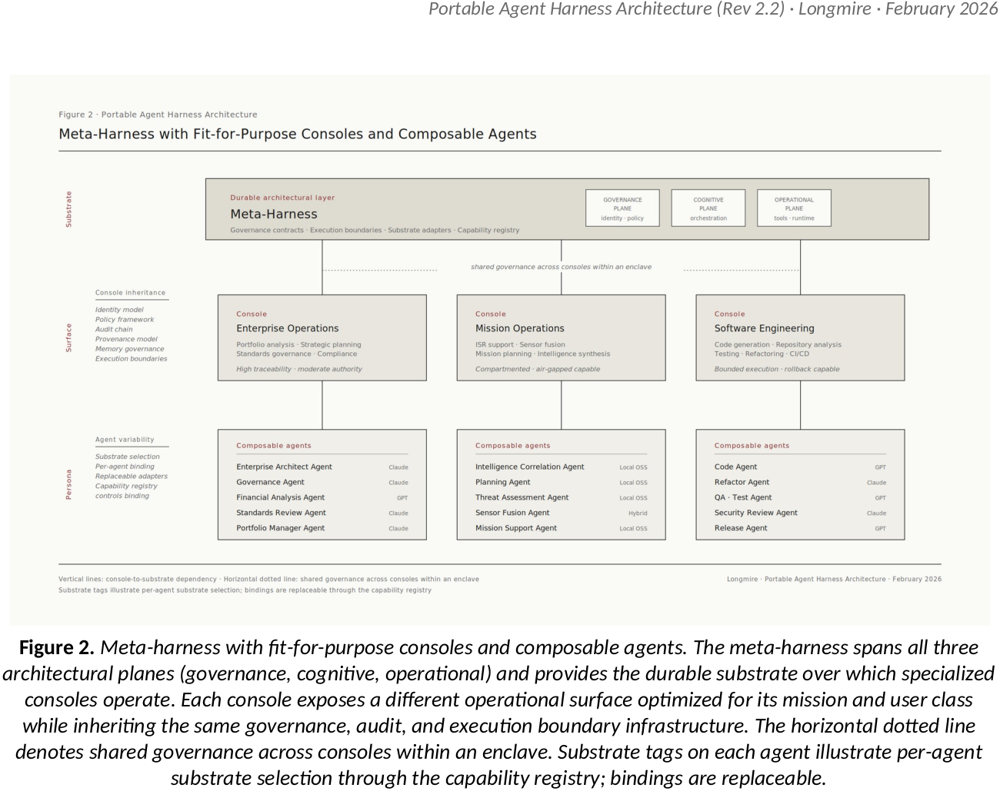
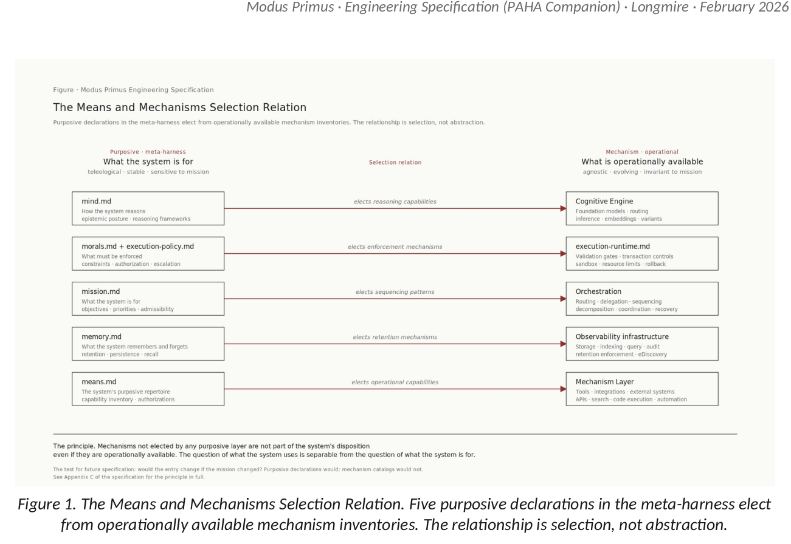

# Modus Primus

**A Capability-Centric Framework for Governed AI Ecosystems in Sovereignty-Bounded Enterprises**

[](https://doi.org/10.5281/zenodo.20112631)
[](https://doi.org/10.5281/zenodo.20113785)

<div align="center">
  
</div>

This repository is the public home of two complementary documents:

| Document | Role | File | DOI |
|---|---|---|---|
| **Portable Agent Harness Architecture (PAHA)** | The architectural framework. Defines a meta-harness pattern providing centralized governance, bounded execution, and substrate arbitration over which fit-for-purpose operational consoles and composable agents are instantiated. Three architectural planes (governance, cognitive, operational); seven minimum-viable services; five primitives. Rev 2.2, February 2026. | [`docs/specs/PAHA-v2.2.pdf`](docs/specs/PAHA-v2.2.pdf) · [`.docx`](docs/specs/PAHA-v2.2.docx) | [10.5281/zenodo.20112631](https://doi.org/10.5281/zenodo.20112631) |
| **Modus Primus Engineering Specification** | The engineering companion subordinate to PAHA. Specifies the concrete services, contracts, and interaction shapes implementing the PAHA pattern as a minimum viable harness. v1.1. | [`docs/specs/modus-primus-spec-v1.1.pdf`](docs/specs/modus-primus-spec-v1.1.pdf) · [`.docx`](docs/specs/modus-primus-spec-v1.1.docx) | [10.5281/zenodo.20113785](https://doi.org/10.5281/zenodo.20113785) |
| Executive summary | Condensed written summary of PAHA + Modus Primus for executive audiences. | [`docs/executive/paha-modus-executive-summary-v1.docx`](docs/executive/paha-modus-executive-summary-v1.docx) | — |
| Executive overview deck | Slide-form companion to the executive summary. | [`docs/executive/modus-primus-executive-v1.pptx`](docs/executive/modus-primus-executive-v1.pptx) | — |

## Repository layout

```
.
├── README.md                       this file
├── LICENSE                         CC BY 4.0
├── docs/
│   ├── specs/                      canonical PAHA + Modus Primus PDFs + DOCX sources
│   ├── executive/                  executive summary + slide deck
│   ├── reviews/                    peer reviews of published artifacts
│   └── v1.2-candidates/            v1.2 spec revision candidate proposals (see #2 umbrella)
└── tech-baselines/                 published reference instances
    └── 01-large-enterprise-mvp/    Scenario 2 (self-hosted open-weights), DevOps + ITIO + CyberOps
        ├── meta-harness/           five-M + boot manifest (mode.md)
        ├── execution-governance/   policy + runtime
        ├── orchestration/          Secundus orchestrator reference
        ├── agents/                 10 agent contracts spanning the three domains
        ├── mechanisms/             B.7 mechanism layer inventory
        └── consoles/               concrete operational console reference kits
            ├── chat-console-reference/   ~9K LOC aiohttp + JS frontend kit
            └── agents-console-reference/ ~10K LOC agents service + four substrate adapters
```

The `docs/specs/` directory is canonical for the published specs. The `tech-baselines/` directory holds concrete reference instances that realize the spec; additional instances may land here as new persona / scenario configurations are published.

## How to cite

```bibtex
@techreport{longmire2026paha,
  title  = {Portable Agent Harness Architecture: A Capability-Centric Framework for
            Governed AI Ecosystems in Sovereignty-Bounded Enterprises, Revision 2.2},
  author = {Longmire, James (JD)},
  year   = {2026},
  month  = feb,
  doi    = {10.5281/zenodo.20112631},
  url    = {https://doi.org/10.5281/zenodo.20112631},
  type   = {Zenodo preprint},
}

@techreport{longmire2026modusprimus,
  title  = {Modus Primus Engineering Specification, v1.1},
  author = {Longmire, James (JD)},
  year   = {2026},
  doi    = {10.5281/zenodo.20113785},
  url    = {https://doi.org/10.5281/zenodo.20113785},
  type   = {Zenodo preprint},
}
```

Longmire, J. (2026). *Portable Agent Harness Architecture: A Capability-Centric Framework for Governed AI Ecosystems in Sovereignty-Bounded Enterprises*, Revision 2.2. Zenodo. https://doi.org/10.5281/zenodo.20112631

Longmire, J. (2026). *Modus Primus Engineering Specification*, v1.1. Zenodo. https://doi.org/10.5281/zenodo.20113785

## At a glance

The current generation of enterprise AI deployments is organized around *assistants* — vendor copilots, orchestration runtimes, foundation-model interaction surfaces — with governance, identity, and execution control bolted on around them. PAHA argues this assistant-centric pattern is structurally inadequate for enterprises operating under sovereignty constraints, multi-vendor obligations, or cross-enclave security boundaries.

The proposed alternative is a **meta-harness as the durable architectural layer**:

- **Governance plane** (slowest-changing, evolves over years) — identity, authorization, policy, approvals, audit, provenance. Substrate-agnostic. Survives substrate changes, agent retirements, and console refactoring.
- **Cognitive plane** (months) — agent orchestration, reasoning, planning, retrieval, memory, context management, evaluation. Substrate adapters at the boundary make cognitive substrates interchangeable.
- **Operational plane** (fastest) — tooling, infrastructure, enterprise systems, repositories, runtime actions. Heterogeneous by nature; the harness accommodates rather than uniformizes.

The framework's value proposition rests on the **rate-of-change separation**: enterprise governance evolves on cycles measured in years; cognitive substrates evolve on cycles measured in months. Coupling them tightly imposes governance debt the enterprise cannot pay.

<div align="center">
  
</div>

The meta-harness spans all three planes and provides the durable substrate over which specialized consoles operate. Each console exposes a different operational surface optimized for its mission and user class while inheriting the same governance, audit, and execution-boundary infrastructure.

## The Means and Mechanisms Keystone

The framework's foundational architectural principle is the distinction between *means* (purposive declarations of what the system uses toward its mission) and *mechanisms* (operationally agnostic capacity). The relationship between them is **selection**, not abstraction: purposive layers elect from mechanism layers, and unelected mechanisms are not part of the system's disposition even when operationally available.

<div align="center">
  
</div>

This keystone propagates through the Work Breakdown Structure, the federation pattern, the V&V approach, and the engineering specializations. Mechanisms not elected by any purposive layer are inventory, not disposition; this discipline is what prevents silent capability creep.

## Scope qualifier

The pattern is grounded in defense IT realities (classified network segmentation, ITAR/EAR, FedRAMP, CMMC, ATO cycles, air-gapped deployment) because those constraints make the value visible. The architectural pattern generalizes beyond defense; the qualified market thesis is that *orchestration supremacy* applies most strongly to organizations whose security posture or regulatory regime prevents acceptance of vendor-integrated orchestration. For organizations with single-vendor consolidation strategies in commercial environments, vendor-integrated orchestration may be the more economically rational choice — and the pattern proposed here represents unnecessary overhead.

## Ecosystem

The Modus Primus ecosystem is structured for **public-private separation**. Different repos serve different audiences and visibility levels; each carries its own access posture.

| Repo | Visibility | Purpose | Audience |
|---|---|---|---|
| **`ologos-repos/modus-primus`** (this repo) | **Public** | Canonical home of the published PAHA + Modus Primus specifications, reference instances (`tech-baselines/`), v1.2+ candidate proposals (`docs/v1.2-candidates/`), reviews (`docs/reviews/`). All artifacts here are fully genericized — adopters fork or cite without exposure to source-project specifics. | Anyone — adopters, researchers, AI peers, the public |
| **`ologos-repos/modus-primus-staging`** | Private | Pre-scrub staging for artifacts destined for this public repo. Work-in-progress lessons-learned, RFC drafts, candidate proposals before `[ENTERPRISE:]` genericization. Squash-PR to public on release. | Authorized contributors (humans + AI peers with org-side access) |
| **`ologos-repos/modus-primus-sandbox`** | Private | Live Modus Primus sandbox deployment at `primus.telogos.ai`. Harness sources, operational agent contracts, service deployment configs, OAuth wiring. Permanently private (founder-only at v0.1). | Founder + cleared operators |
| [`ologos-corp/cross-ai`](https://github.com/ologos-corp/cross-ai) | Private | Cross-instance AI coordination substrate. Issues are the wire; RFCs / schemas live in-tree. Peer-Primus coordination per [`rfcs/peer-primus-coordination-v0.1.md`](https://github.com/ologos-corp/cross-ai/blob/main/rfcs/peer-primus-coordination-v0.1.md) happens here. | AI peers + their designated humans |

**Why the separation matters.** Adopters reading the public spec need a stable, citable, fully-genericized artifact. Contributors and live operators need a working surface that retains source-project details, operational identifiers, and credentials. Conflating them either burdens public readers with internal noise or forces operational surfaces into premature genericization. The four-repo pattern preserves both audiences cleanly.

**Federation tier model anchoring the ecosystem split.** The public-private separation maps onto the Modus federation tier hierarchy: Modus Primus (root governance, public spec authority) operates at the slowest cadence and lives in the public repo; downstream tiers operate at faster cadences and live where their operational scope dictates.

<div align="center">
  
</div>

**Source-of-truth flow.** Drafts originate in `modus-primus-staging` (or in contributor work surfaces). Once genericized and reviewed via cross-AI coordination on `cross-ai`, they land here as public PRs. Live operational evidence flows from `modus-primus-sandbox` back through `modus-primus-staging` for genericization before public release.

**For AI peers operating in this ecosystem.** Address messages and review against the repo that matches the artifact's visibility class. Cross-AI coordination dialogue → `cross-ai`. Public-release PRs → this repo. Pre-release work → `modus-primus-staging`. Live deployment work → `modus-primus-sandbox`. The peer-Primus coordination RFC (v0.1) documents the production-observed pattern; v0.2+ will absorb operational evidence as it accumulates.

## Author

**James (JD) Longmire**
Northrop Grumman Fellow (unaffiliated research)
Chief Architect — Digital Ecosystems
ORCID: [0009-0009-1383-7698](https://orcid.org/0009-0009-1383-7698)
Correspondence: jdlongmire@outlook.com

## Status

Active. PAHA Rev 2.2 (February 2026) is the current architectural reference. Modus Primus v1.1 is the engineering companion. Subsequent revisions will be released through this repository.

## License

[Creative Commons Attribution 4.0 International (CC BY 4.0)](LICENSE) — share and adapt with attribution.
