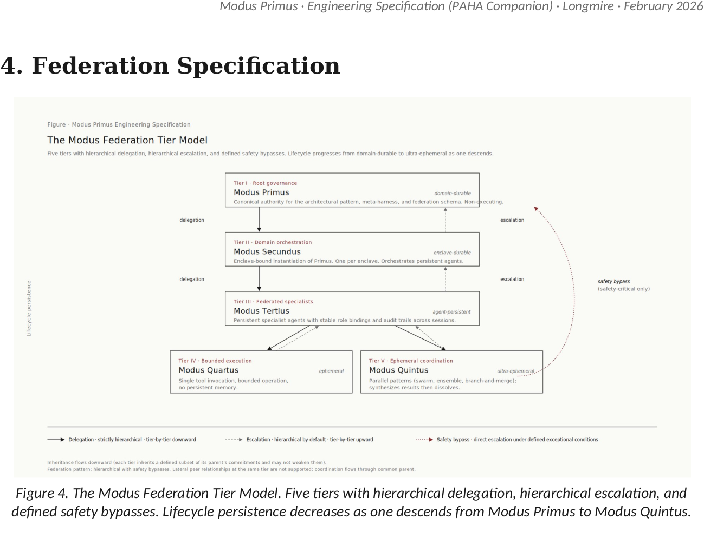

# Agents Console Reference Kit

Sanitized reference implementation of the agent operations console layer of a Modus Primus instance. Lives under [`tech-baselines/01-large-enterprise-mvp/consoles/agents-console-reference/`](.) and is the operational counterpart to the chat console reference at [`../chat-console-reference/`](../chat-console-reference/).

<div align="center">
  
</div>

This kit is the operational surface for **Modus Tertius** in the federation tier model above — the persistent specialist agents tier with stable role bindings and audit trails. The console manages spec catalog (agent contracts), run history (Tertius invocations including Quartus tool-bound execution and Quintus ephemeral parallel coordination), and the substrate-adapter layer that binds agents to their elected cognitive engines.

## What this is

A working agent-operations console that serves as the operational surface for the Modus Tertius layer: spec catalog, run history, audit traces, agent invocation dispatch, suspension/clearance workflows, and substrate-adapter management. Engineers and agent owners engage through this surface to author, invoke, monitor, and revise agent runs.

The kit is generic — every source-project identifier has been replaced with `[ENTERPRISE:]` markers. Adopters fork this directory, resolve the markers per their environment, and deploy.

## What this kit is not

- **Not production-ready out-of-the-box.** `[ENTERPRISE:]` markers must be resolved.
- **Not opinionated about cognitive substrate.** The `src/runtime/` layer ships reference adapters for self-hosted (Ollama-class), cognitive-engine-CLI (substrate-agnostic subprocess), and vendor APIs (OpenAI-class, Anthropic-class, Gemini-class). Adopters select per substrate procurement.
- **Not opinionated about deployment topology.** systemd-user service template is one reference; container, orchestrator, and PaaS surfaces are equivalent (see `deploy/`).
- **Not opinionated about private connectivity.** See `network/`.

## Layout

```
agents-console-reference/
├── README.md                       this file
├── src/                            sanitized source code
│   ├── app.py                      aiohttp entry point
│   ├── routes.py                   route definitions
│   ├── schema.sql                  SQLite schema (specs, runs, audit)
│   ├── runtime/                    substrate adapters + run execution
│   │   ├── backend.py              abstract adapter interface
│   │   ├── ollama_backend.py       self-hosted inference adapter
│   │   ├── openai_backend.py       vendor API adapter
│   │   ├── gemini_backend.py       vendor API adapter
│   │   ├── claude_cli_backend.py   cognitive-engine CLI adapter
│   │   ├── audit.py                audit-record emission
│   │   ├── judge.py                spec-result evaluation
│   │   ├── daemon.py               background run scheduler
│   │   └── ...                     supporting modules
│   ├── specs/                      agent specifications (curated)
│   │   ├── loader.py               spec loader + validator
│   │   ├── model.py                spec data model
│   │   ├── research/               example research-class specs
│   │   ├── services/               example service-class specs
│   │   ├── workflows/              example workflow specs
│   │   ├── triggers/               example trigger specs
│   │   └── ops/                    example ops-class specs
│   ├── tests/                      unit + integration suite
│   ├── web/                        web UI assets
│   ├── requirements.txt
│   ├── requirements-dev.txt
│   └── pyproject.toml
├── deploy/                         deployment artifacts
│   ├── README.md
│   ├── .env.example
│   └── agents.service.template
└── network/                        private-connectivity reference
    └── README.md
```

## Reading order

1. **This README** — overview, layout
2. **`deploy/README.md`** — deployment patterns
3. **`network/README.md`** — private-connectivity adapter patterns
4. **`src/README.md`** — application architecture
5. **`src/specs/model.py`** — spec data model (the canonical structure for agent specifications)
6. **`src/specs/research/hello-world.md`** — simplest spec example; demonstrates the pattern
7. **`src/specs/research/sensitive-task.md`** — governance-gated spec example
8. **`src/specs/workflows/research-chain.md`** — multi-step workflow example
9. **`src/runtime/backend.py`** — adapter interface; what adopters implement against
10. **`src/runtime/audit.py`** — audit-record emission; federation-bus integration point

## Integration with the parent tech baseline

This kit realizes specific entries in the parent `tech-baselines/01-large-enterprise-mvp/`:

| WBS reference | Realized by this kit |
|---|---|
| B.5 (Orchestration Layer) | Run scheduling and routing; `src/runtime/daemon.py` |
| B.6.2 (Agent mechanics) | Agent lifecycle, identity, memory scope at the run level |
| B.6.3 (Agent contract format) | Spec model — `src/specs/model.py` realizes the Appendix E format as data |
| B.7.1.10 (Automation pipelines) | Scheduled and triggered run execution |
| B.8.2 (`execution-runtime.md`) | Pre-action validation, sandbox enforcement at run dispatch |
| B.10.1.2 (Auditability) | Audit-record emission to federation bus |
| B.10.2 (Runtime assurance) | Per-run behavioral baselines + drift signal aggregation (partial; calibrated per spec) |

The kit is one operational realization. Adopters operating different agent-ops preferences can substitute their own concrete implementation at the same WBS entries.

## Spec catalog (representative, curated)

The shipped specs are a curated subset demonstrating the spec patterns rather than an exhaustive operational catalog. Adopters extend with their own specs per the parent baseline's agent catalog (`agents/agents.md`).

| Category | Representative specs |
|---|---|
| Research (hello-world / smoke) | `hello-world.md`, `ollama-hello.md`, `openai-hello.md`, `gemini-hello.md` |
| Research (governance) | `sensitive-task.md` (demonstrates approval-gate pattern) |
| Research (utility) | `concise-summary.md`, `file-reader.md` |
| Service (daemon) | `console.md`, `comment-monitor-timer.md`, `blocker-poll-timer.md` |
| Service (cross-fleet coordination) | `cross-fleet-coord-watcher.md`, `cross-fleet-coord-digest-timer.md` |
| Workflow | `research-chain.md` (multi-step chain across substrates) |
| Trigger | `heartbeat.md` (periodic trigger pattern) |
| Ops | `check-services.md` (health-check pattern) |

## License

Inherited from the parent baseline: CC BY 4.0.

## Provenance

Sanitized from a production reference deployment. All source-project identifiers, host addresses, identity references, and substrate-vendor specifics have been replaced with `[ENTERPRISE:]` markers per the genericization criteria in the parent baseline tracking issue. The spec catalog was curated to drop project-specific operational specs (Telegram bridges, email bots, project-internal reminders) in favor of pattern-demonstrating representative specs.

Adopters reporting marker gaps or content that should be further generalized should file against the parent baseline.
